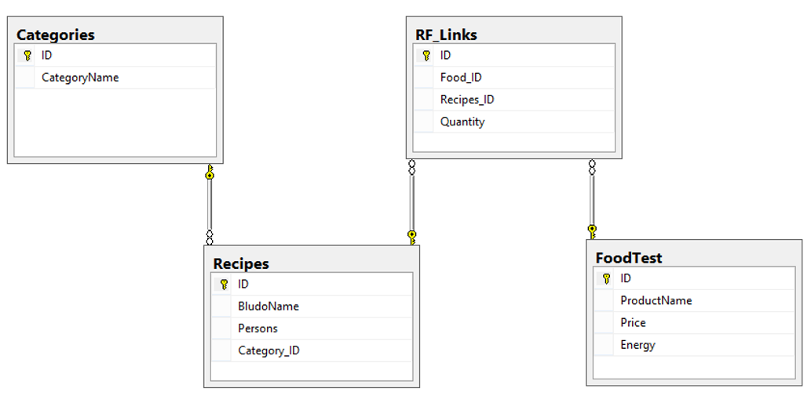
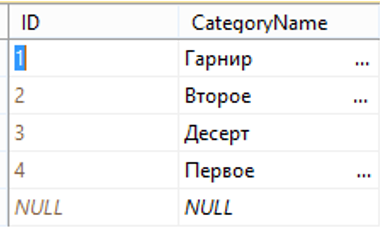
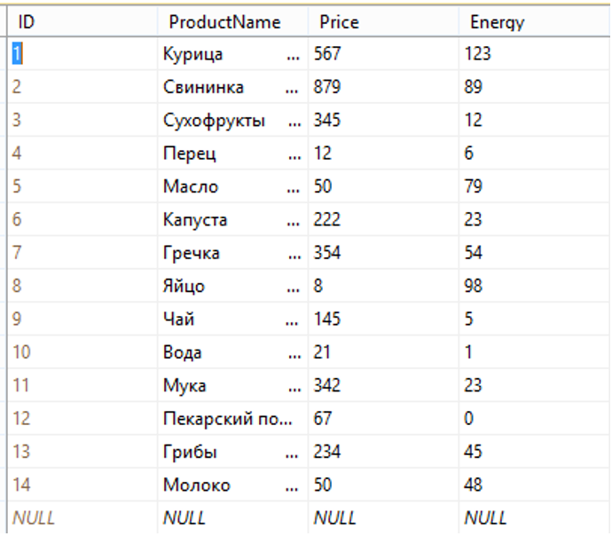
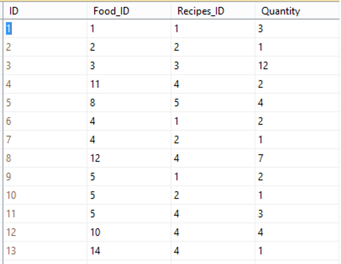
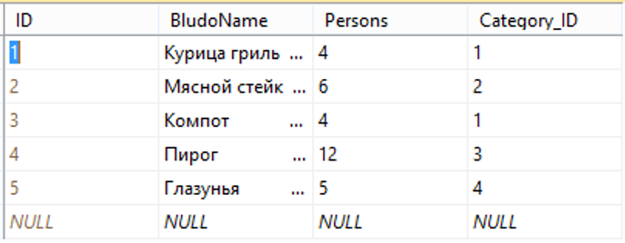
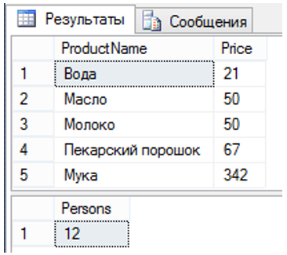
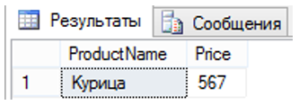

# База данных на основе СУБД SQL Server 2012
<h1>Содержание</h1>
  <ul>
    <li><a href="#">Задача</a></li>
    <li><a href="#create">SQL-скрипт создание БД</a></li>
    <li><a href="#diagram">Структура БД</a></li>
    <li><a href="#request">Запросы к БД</a></li>
    <li><a href="#exp">Полученный мною опыт</a></li>
  </ul>
<h2 id="task">Задача</h2>
<p align="justify">
  Разработать и заполнить базу данных, предназначенную для представления данных, описанных в ниже. 
</p>
<h3>Таблица 1. Структура таблицы Categories (Категории продуктов)</h3>
<table>
    <tr>
        <td><b>Имя столбца</b></td>
        <td><b>Тип данных</b></td>
        <td><b>Описание</b></td>
    </tr>
    <tr>
        <td>ID</td>
        <td>int</td>
        <td>Первичный ключ</td>
    </tr>
    <tr>
        <td>CategoryName</td>
        <td>nvarchar(30)</td>
        <td>Наименование категории</td>
    </tr>
</table>
<h3>Таблица 2. Структура таблицы FoodTest (Продукты)</h3>
<table>
    <tr>
        <td><b>Имя столбца</b></td>
        <td><b>Тип данных</b></td>
        <td><b>Описание</b></td>
    </tr>
    <tr>
        <td>ID</td>
        <td>int</td>
        <td>Первичный ключ</td>
    </tr>
    <tr>
        <td>ProductName</td>
        <td>nvarchar(30)</td>
        <td>Наименование продукта</td>
    </tr>
    <tr>
        <td>Price</td>
        <td>int</td>
        <td>Цена</td>
    </tr>
    <tr>
        <td>Energy</td>
        <td>int</td>
        <td>Калорийность</td>
    </tr>
</table>
<h3>Таблица 3. Структура таблицы Recipes (Рецепты)</h3>
<table>
    <tr>
        <td><b>Имя столбца</b></td>
        <td><b>Тип данных</b></td>
        <td><b>Описание</b></td>
    </tr>
    <tr>
        <td>ID</td>
        <td>int</td>
        <td>Первичный ключ</td>
    </tr>
    <tr>
        <td>BludoName</td>
        <td>nvarchar(30)</td>
        <td>Наименование блюда</td>
    </tr>
    <tr>
        <td>Persons</td>
        <td>int</td>
        <td>Количество персон</td>
    </tr>
    <tr>
        <td>Category_ID</td>
        <td>int</td>
        <td>Ключ категории</td>
    </tr>
</table>
<h3>Таблица 4. Структура таблицы RF_Links (Связи «рецепты-продукты»)</h3>
<table>
    <tr>
        <td><b>Имя столбца</b></td>
        <td><b>Тип данных</b></td>
        <td><b>Описание</b></td>
    </tr>
    <tr>
        <td>ID</td>
        <td>int</td>
        <td>Первичный ключ</td>
    </tr>
    <tr>
        <td>Food_ID</td>
        <td>int</td>
        <td>Ключ продукта</td>
    </tr>
    <tr>
        <td>Recipes_ID</td>
        <td>int</td>
        <td>Ключ блюда</td>
    </tr>
    <tr>
        <td>Quantity</td>
        <td>int</td>
        <td>Количество</td>
    </tr>
</table>

<h2 id="create">SQL-скрипт создание БД</h2>

```sql
CREATE TABLE [dbo].[Categories](
	[ID] [int] IDENTITY(1,1) NOT NULL,
	[CategoryName] [nchar](30) NOT NULL,
 CONSTRAINT [PK_Categories] PRIMARY KEY CLUSTERED 
(
	[ID] ASC
)WITH (PAD_INDEX = OFF, STATISTICS_NORECOMPUTE = OFF, IGNORE_DUP_KEY = OFF, ALLOW_ROW_LOCKS = ON, ALLOW_PAGE_LOCKS = ON) ON [PRIMARY]
) ON [PRIMARY]
GO

CREATE TABLE [dbo].[FoodTest](
	[ID] [int] IDENTITY(1,1) NOT NULL,
	[ProductName] [nchar](30) NOT NULL,
	[Price] [int] NOT NULL,
	[Energy] [int] NOT NULL,
 CONSTRAINT [PK_FoodTest] PRIMARY KEY CLUSTERED 
(
	[ID] ASC
)WITH (PAD_INDEX = OFF, STATISTICS_NORECOMPUTE = OFF, IGNORE_DUP_KEY = OFF, ALLOW_ROW_LOCKS = ON, ALLOW_PAGE_LOCKS = ON) ON [PRIMARY]
) ON [PRIMARY]
GO

CREATE TABLE [dbo].[Recipes](
	[ID] [int] IDENTITY(1,1) NOT NULL,
	[BludoName] [nchar](30) NOT NULL,
	[Persons] [int] NOT NULL,
	[Category_ID] [int] NOT NULL,
 CONSTRAINT [PK_Recipes] PRIMARY KEY CLUSTERED 
(
	[ID] ASC
)WITH (PAD_INDEX = OFF, STATISTICS_NORECOMPUTE = OFF, IGNORE_DUP_KEY = OFF, ALLOW_ROW_LOCKS = ON, ALLOW_PAGE_LOCKS = ON) ON [PRIMARY]
) ON [PRIMARY]
GO
ALTER TABLE [dbo].[Recipes]  WITH CHECK ADD  CONSTRAINT [FK_Recipes_Categories] FOREIGN KEY([Category_ID])
REFERENCES [dbo].[Categories] ([ID])
GO
ALTER TABLE [dbo].[Recipes] CHECK CONSTRAINT [FK_Recipes_Categories]
GO

CREATE TABLE [dbo].[RF_Links](
	[ID] [int] IDENTITY(1,1) NOT NULL,
	[Food_ID] [int] NOT NULL,
	[Recipes_ID] [int] NOT NULL,
	[Quantity] [int] NOT NULL,
 CONSTRAINT [PK_RF_Links] PRIMARY KEY CLUSTERED 
(
	[ID] ASC
)WITH (PAD_INDEX = OFF, STATISTICS_NORECOMPUTE = OFF, IGNORE_DUP_KEY = OFF, ALLOW_ROW_LOCKS = ON, ALLOW_PAGE_LOCKS = ON) ON [PRIMARY]
) ON [PRIMARY]
GO
ALTER TABLE [dbo].[RF_Links]  WITH CHECK ADD  CONSTRAINT [FK_RF_Links_FoodTest] FOREIGN KEY([Food_ID])
REFERENCES [dbo].[FoodTest] ([ID])
GO
ALTER TABLE [dbo].[RF_Links] CHECK CONSTRAINT [FK_RF_Links_FoodTest]
GO
ALTER TABLE [dbo].[RF_Links]  WITH CHECK ADD  CONSTRAINT [FK_RF_Links_Recipes] FOREIGN KEY([Recipes_ID])
REFERENCES [dbo].[Recipes] ([ID])
GO
ALTER TABLE [dbo].[RF_Links] CHECK CONSTRAINT [FK_RF_Links_Recipes]
GO
```
<h2 id="diagram">Структура БД</h2>


<h2 id="add">Заполнение таблиц данными</h2>





<h2 id="request">Запросы к БД</h2>

```sql
-- Вывод списка продуктов и сметы для данного блюда
select FoodTest.ProductName, FoodTest.Price
from FoodTest INNER JOIN
     RF_Links ON RF_Links.Food_ID = FoodTest.ID INNER JOIN
	 Recipes ON Recipes.ID = RF_Links.Recipes_ID
where Recipes.BludoName = 'Пирог'
group by FoodTest.Price, FoodTest.ProductName

select Recipes.Persons 
from Recipes
where Recipes.BludoName = 'Пирог'
group by Recipes.Persons
```
<p>Запрос 1: Вывод списка продуктов и сметы для данного блюда</p>


```sql
-- Поиск цены по наименованию продукта
select FoodTest.ProductName, FoodTest.Price
from FoodTest
where FoodTest.ProductName = 'Курица'
```

<p>Запрос 2: Поиск цены по наименованию продукта</p>


```sql
--Поиск цены по наименованию блюда
select Recipes.BludoName, SUM(FoodTest.Price) AS Цена
from Recipes INNER JOIN 
     RF_Links ON RF_Links.Recipes_ID = Recipes.ID INNER JOIN
	 FoodTest ON FoodTest.ID = RF_Links.Food_ID
where Recipes.BludoName = 'Пирог'
group by Recipes.BludoName
```

<p>Запрос 3: Вывод списка продуктов и сметы для данного блюда</p>


<h2 id="exp">Полученный мною опыт</h2>
<ul>
<li>Опыт работы с SQL в среде MS SQL Server 2012;</li>
<li>Научился создавать таблицы;</li>
<li>Осуществлять между ними отношения;</li>
<li>Выполнять к БД запросы.</li>
</ul>
